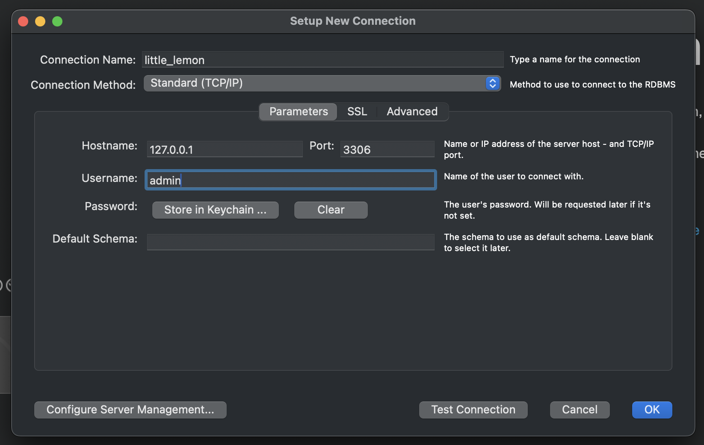
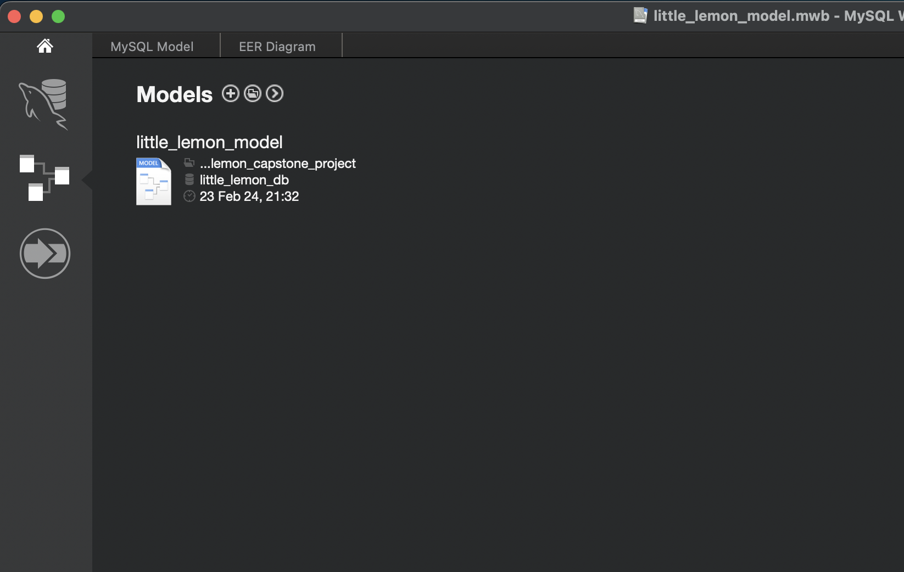
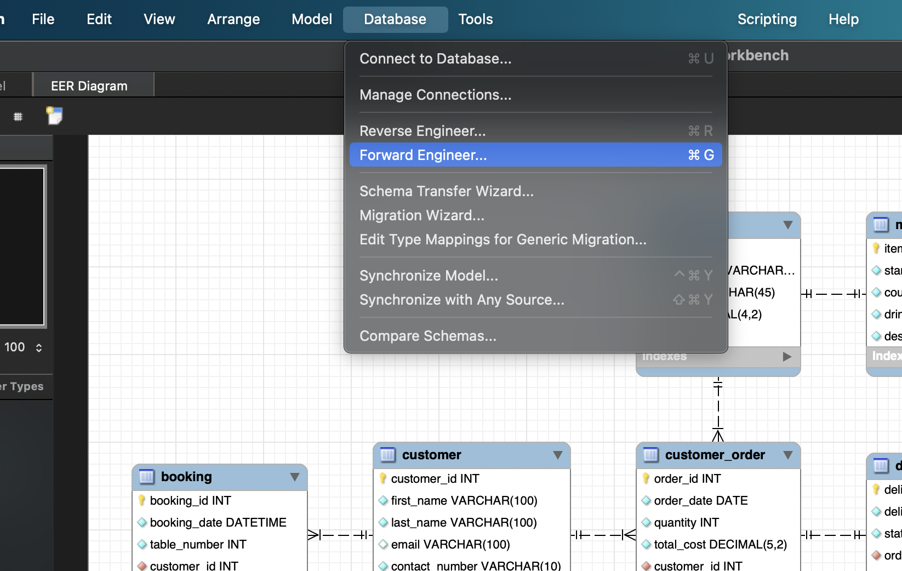
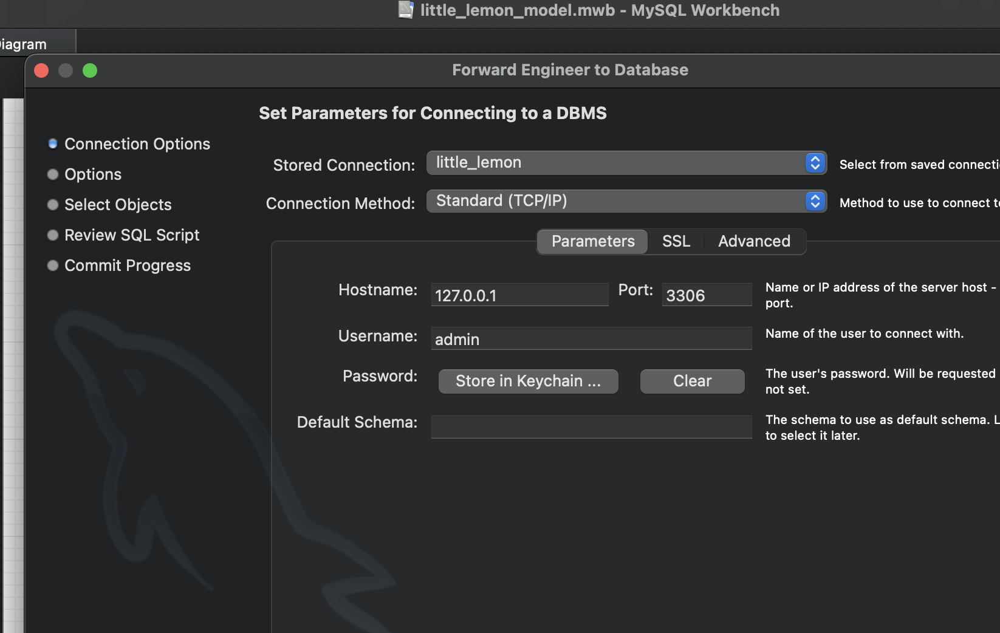
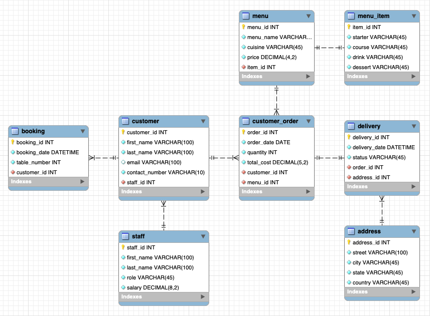
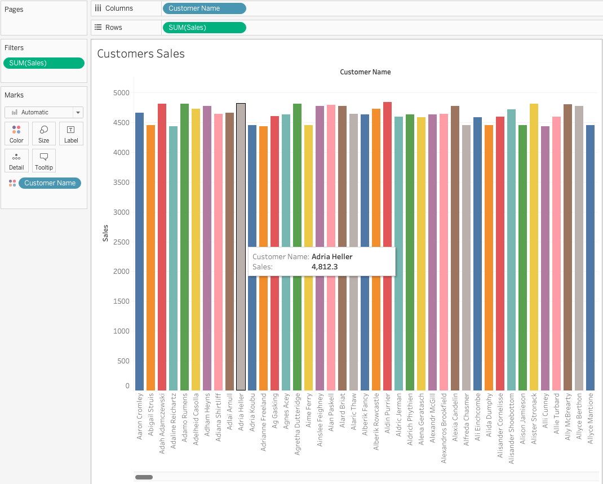
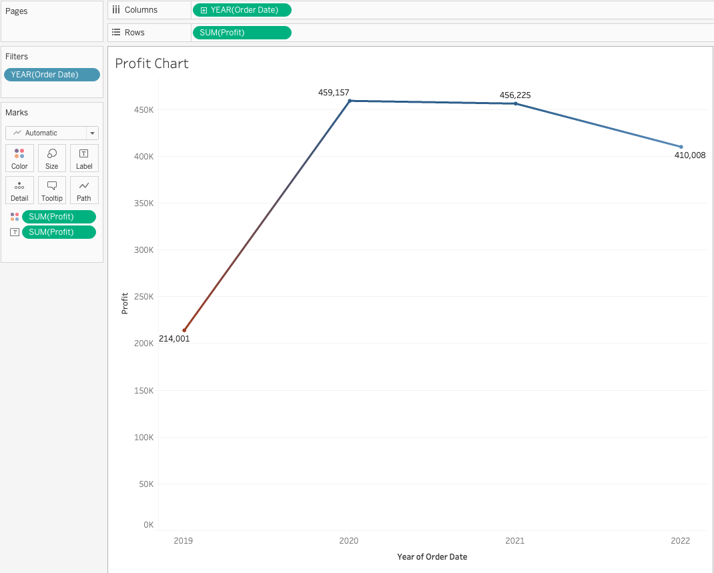
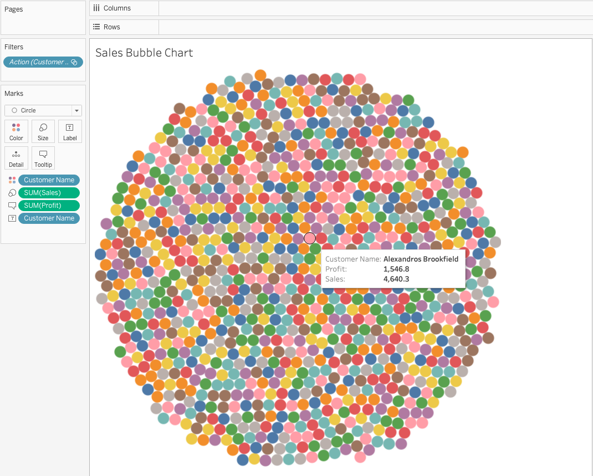
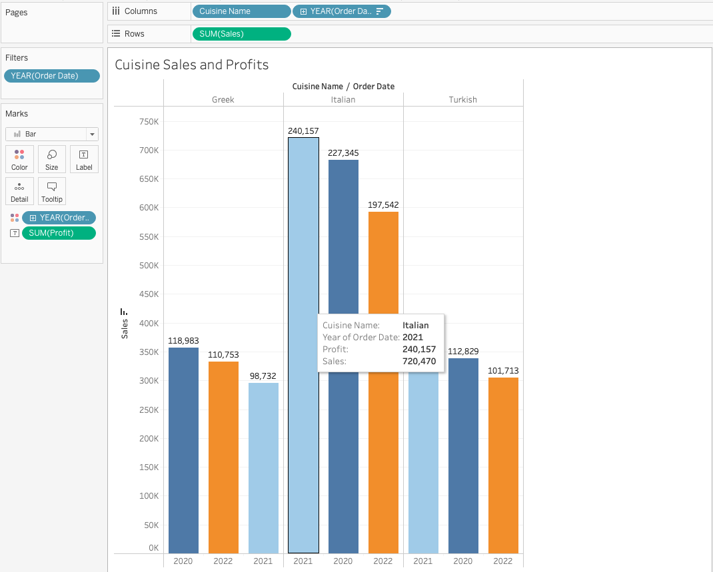
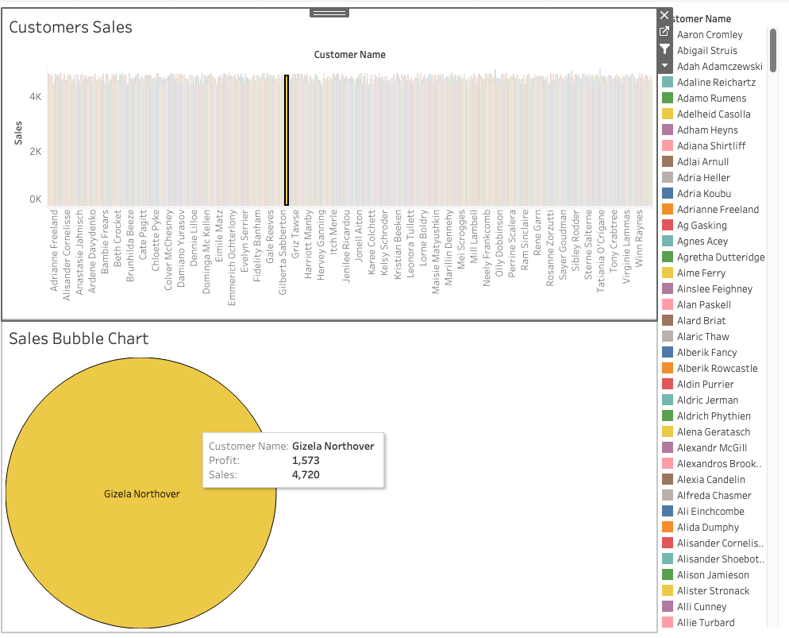

# Little Lemon Capstone Project

This is the capstone project from the Meta Database Engineer Professional Certificate provided on Coursera. The objective of this project is to optimize querying data from the MySQL database using various database objects and to create visualization using Tableau.

Database: MySQL
 Visualization: Tableau

## Set up

Make sure both MySQL server and MySQL Workbench are downloaded and installed on your machine.

MySQL Community: https://dev.mysql.com/downloads/mysql/
 MySQL Workbench: https://dev.mysql.com/downloads/workbench/

### Step 1. Create Server Instance

Create a server instance using Workbench.

### Step 2. Load Database Model

Load database model and utilize forward engineering to create tables for storing data.

Model File: `little_lemon_model.mwb`
 You can double click on the file to open it on in Workbench.

### Step 3. Run SQL script

1. Double click on `data.sql` to load data
2. Double click on each SQL script to open and run in Workbench

## Database ERD

## Visualization with Tableau

> **NOTE:** Data used in Tableau is a excel file provided by Meta, hence different from the data in `data.sql`.

### Customers Sales

### Profits between 2019 and 2022

### Customers Bubble Chart

### Cuisine Sales and Profits

### Dashboard

